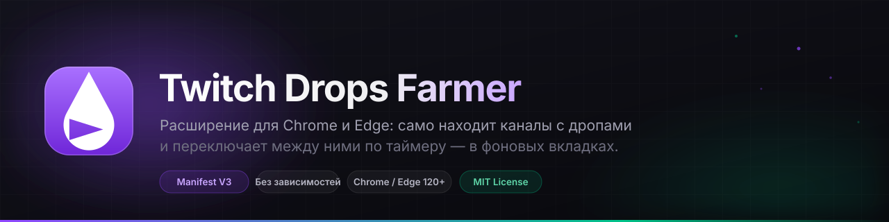
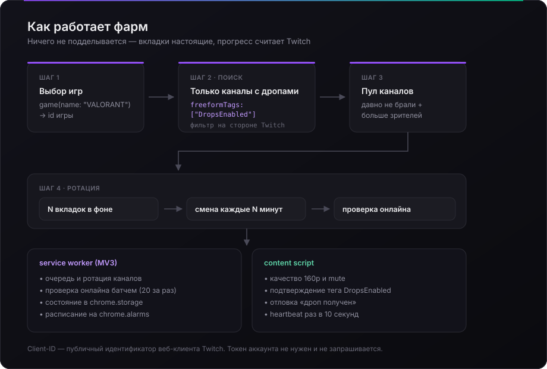
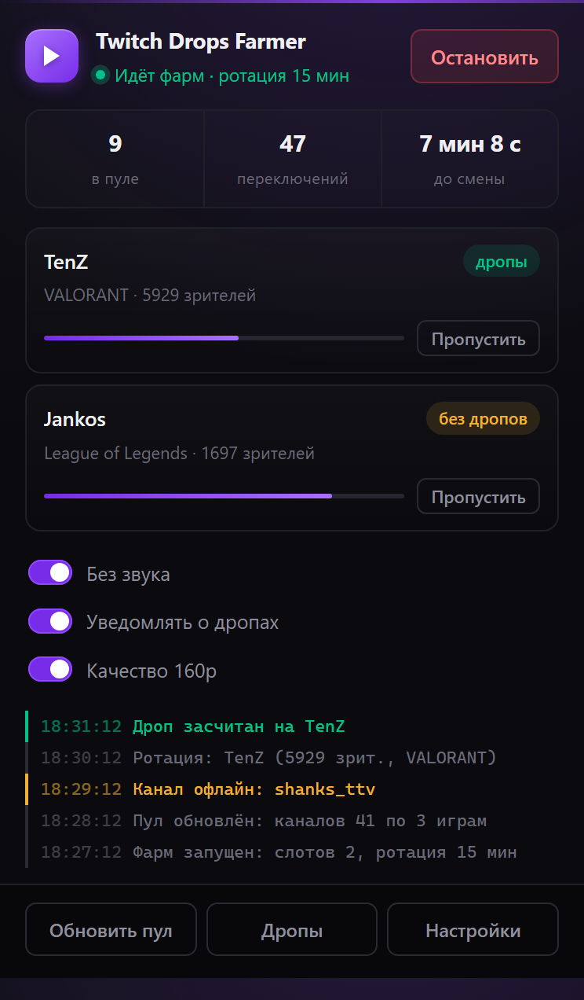
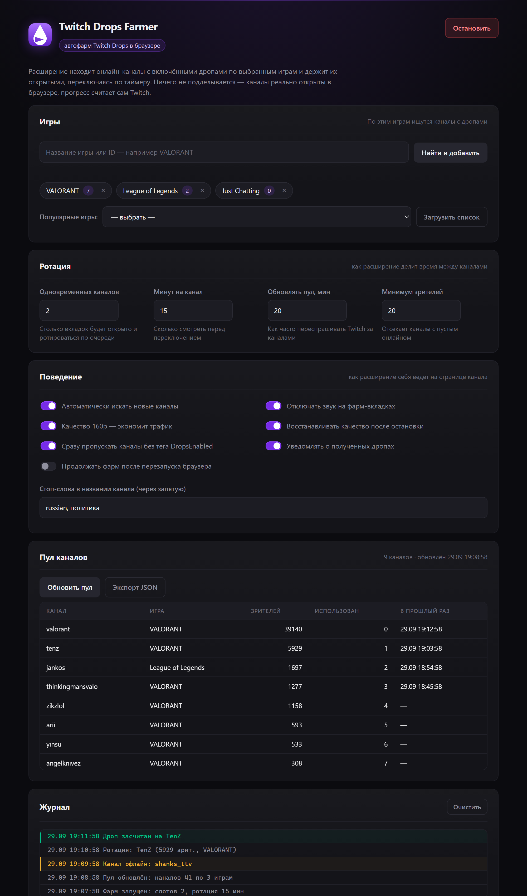

<div align="center">



<br/>

<a href="https://github.com/Mextrim/twitch-drops-farmer/releases/latest">
  
</a>
&nbsp;&nbsp;
<a href="releases/tag/v1.0.0">
  
</a>

<br/><br/>

[](https://github.com/Mextrim/twitch-drops-farmer/actions/workflows/ci.yml)
[](https://developer.chrome.com/docs/extensions/mv3/intro/)
[](https://developer.chrome.com/docs/extensions/)
[](https://learn.microsoft.com/microsoft-edge/extensions-chromium/)
[](LICENSE)
[](package.json)
[](releases/latest)

</div>

---

<p align="center">
  <em>Обычные вкладки с обычным плеером. Прогресс считает сам Twitch —<br/>
  токен аккаунта не запрашивается и нигде не хранится.</em>
</p>

## Оглавление

- [Зачем](#зачем)
- [Как это работает](#как-это-работает)
- [Возможности](#возможности)
- [Установка](#установка)
- [Настройки](#настройки)
- [Скриншоты](#скриншоты)
- [Разработка](#разработка)
- [Ограничения](#ограничения)
- [Ответственность](#ответственность)

---

## Зачем

Twitch Drops капают, пока ты смотришь канал с включёнными дропами. Но вручную это утомительно:

- нужные каналы надо искать по каждой игре отдельно;
- они постоянно уходят в офлайн и появляются новые;
- держать вкладку с включённым звуком неудобно.

Расширение делает это само: спрашивает у Twitch список стримов **с включёнными
дропами**, ранжирует их и крутит по таймеру в фоновых вкладках.

---

## Как это работает

<div align="center">

</div>

Ключевая идея: у каждого стрима в GraphQL Twitch есть свободные теги
`freeformTags`. Когда на канале включены дропы, среди них появляется
`DropsEnabled` — и его можно передать прямо в фильтр запроса:

```graphql
query Farm($id: ID!) {
  game(id: $id) {
    name
    streams(options: { sort: VIEWER_COUNT, freeformTags: ["DropsEnabled"] }) {
      edges { node { viewersCount channel { name displayName } } }
    }
  }
}
```

Ответ содержит **только каналы с дропами** — без перебора и лишних запросов.

> ⚠️ **Тонкость, на которой держится весь поиск:** фильтр работает
> **только как литерал в тексте запроса**. Если передать `freeformTags`
> через `variables`, эндпоинт молча вернёт 0 строк.
> Поэтому в [`twitch-api.js`](src/background/twitch-api.js) запрос собирается
> конкатенацией строки, а `npm run check` следит, чтобы это не «оптимизировали».

Проверка онлайна идёт батчем: GQL принимает массив операций в одном POST —
до 20 каналов за запрос.

---

## Возможности

<table>
<tr>
<td width="50%" valign="top">

**Поиск и ротация**

- 🎯 Поиск каналов с дропами по выбранным играм
- 🔄 От 1 до 4 вкладок одновременно, смена по таймеру
- 🛡 Проверка онлайна каждые 2 минуты — один батч на 20 каналов
- ⏭ Пропуск каналов без тега `DropsEnabled`
- 🚫 Стоп-слова по названию канала
- 📈 Ранжирование: давно не брали + больше зрителей

</td>
<td width="50%" valign="top">

**Комфорт и контроль**

- 🔇 Автоматический mute
- 📉 Качество 160p — трафик почти не тратится
- ↩️ Восстановление качества после остановки
- 🔔 Уведомление при получении дропа
- 📋 Журнал событий с цветовой маркировкой
- ⏯ Продолжение фарма после перезапуска браузера
- 🧠 MV3-safe: `chrome.storage` + `chrome.alarms`
- 🔒 Минимум прав: 4 permission и 2 хоста

</td>
</tr>
</table>

---

## Установка

<a href="https://github.com/Mextrim/twitch-drops-farmer/releases/latest">
  
</a>

**1.** Распакуйте `twitch-drops-farmer-1.0.0.zip`

**2.** Откройте **`chrome://extensions`** (в Edge — `edge://extensions`)

**3.** Включите **«Режим разработчика»**

**4.** **«Загрузить распакованное расширение»** → выберите папку с `manifest.json`

**5.** Закрепите иконку: кнопка «пазлик» → *Twitch Drops Farmer* → «Закрепить»

> Нужен **Chrome / Edge 120+** и **авторизация в Twitch** в этом же браузере:
> без входа дропы не засчитываются.

<details>
<summary><b>Из исходников</b></summary>

```bash
git clone https://github.com/Mextrim/twitch-drops-farmer.git
cd twitch-drops-farmer
npm run build        # зависимостей нет — install не нужен
```

Готовый пакет появится в `dist/twitch-drops-farmer/`.

</details>

Подробности и разбор проблем — в [INSTALL.md](INSTALL.md).

---

## Настройки

| Параметр | По умолчанию | Что делает |
|:---|:---:|:---|
| Игры | — | Список игр для поиска каналов |
| Одновременных каналов | `1` | Сколько вкладок держать открытыми (1–4) |
| Минут на канал | `15` | Сколько смотреть перед переключением |
| Обновлять пул, мин | `20` | Как часто переспрашивать Twitch |
| Минимум зрителей | `0` | Отсекает каналы с пустым онлайном |
| Без звука | ✅ | Mute на фарм-вкладках |
| Качество 160p | ✅ | Экономит трафик |
| Восстанавливать качество | ✅ | Возвращает прежнее качество после остановки |
| Пропускать без дропов | ✅ | Уходит с канала без тега `DropsEnabled` |
| Уведомлять о дропах | ✅ | Уведомление при получении |
| Продолжать после перезапуска | ✅ | Продолжает фарм при старте браузера |

---

## Скриншоты

<div align="center">
<table>
<tr>
<td align="center"><br/><sub><b>Панель расширения</b><br/>статус, активные каналы, быстрые настройки</sub></td>
<td align="center"><br/><sub><b>Страница настроек</b><br/>игры, ротация, пул каналов, журнал</sub></td>
</tr>
</table>
</div>

---

## Разработка

```bash
npm run check     # манифест, import-пути, синтаксис, соглашения — без сети
npm run test      # самотест движка на живом API Twitch
npm run build     # сборка dist/ + zip
npm run icons     # перегенерация иконок
npm run serve     # предпросмотр UI на http://localhost:8123
```

`npm run test` поднимает настоящий обмен с Twitch: discovery, пул, слоты,
ротация, реакция на офлайн, остановка. Зависимостей у проекта нет.

Предпросмотр интерфейса без установки расширения:

```
http://localhost:8123/tools/ui-preview/index.html?page=popup
http://localhost:8123/tools/ui-preview/index.html?page=options
```

### Структура

```
manifest.json              Manifest V3
icons/                     иконки (генерируются)
docs/                      баннер, схема, скриншоты
src/
  shared/                  константы, хранилище, форматирование
  background/
    service-worker.js      вход, маршрутизация сообщений, будильники
    twitch-api.js          GraphQL: игры, поиск каналов, проверка онлайна
    farmer.js              движок: пул, слоты, ротация, офлайн-реакция
  content/
    farm-tab.js            качество, звук, тег дропов, «дроп получен»
  popup/  options/         интерфейс
tools/                     сборка, проверки, тесты, иконки, предпросмотр
```

---

## Ограничения

- **Пул ограничен тем, что отдаёт Twitch:** ~10 каналов на игру за запрос.
  Расширение делает два запроса с разной сортировкой (`VIEWER_COUNT` и
  `RECENT`), поэтому пул обычно вдвое больше.
- **Онлайн-статус берётся из API, а не из DOM:** на странице Twitch плеер может
  быть перекрыт диалогом, и вердикт «офлайн» получался бы ложным.
- **Тег `DropsEnabled` рендерится с задержкой:** первые 25 секунд расширение
  отвечает «не знаю» и не переключает канал наугад.
- **Стримы грузятся на 160p:** трафик уменьшается, но не обнуляется.

---

## Ответственность

Автоматизация просмотра находится в серой зоне правил Twitch. Расширение
сделано максимально «честно» — это обычные вкладки с обычным плеером, — но риск
блокировки аккаунта исключить нельзя. Используйте на свой страх и как вам уместно.

---

<div align="center">

<sub>
MIT License · сделано для личного использования<br/><br/>
Twitch и его логотипы — торговые марки Twitch Interactive, Inc.<br/>
Проект не связан с Twitch и не одобрен ими.
</sub>

</div>
